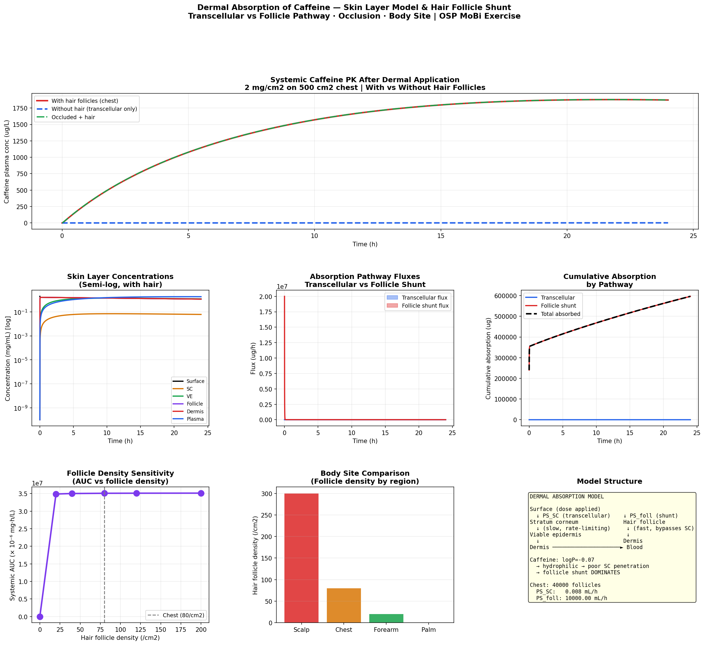

# Dermal Absorption of Caffeine
**Skin Layer Model · Hair Follicle Shunt Pathway · Transcellular vs Follicle | OSP MoBi Exercise**

## Overview
Dermal PBPK model for caffeine applied topically on the chest, implemented
in Python and R. Reproduces the OSP MoBi v11 Dermal Absorption exercise.
Demonstrates how two parallel absorption pathways — transcellular (through
stratum corneum) and hair follicle shunt — compete, and why the follicle
pathway dominates for hydrophilic compounds like caffeine.

## Why Caffeine?

Caffeine (logP = −0.07) is hydrophilic — it cannot easily penetrate the
lipid-rich stratum corneum via the transcellular route. This makes it the
ideal model compound for demonstrating follicle shunt dominance:

```
Transcellular route:   Surface → SC → VE → Dermis → Blood
                                 ↑
                         (lipid barrier — hydrophilic drugs struggle)

Hair follicle shunt:   Surface → Follicle → Dermis → Blood
                                 ↑
                         (aqueous channel — hydrophilic drugs go HERE)
```

## Model Structure (MoBi Containers + Neighborhoods)

| Container | Thickness | PS value | Role |
|---|---|---|---|
| Skin surface | Dose vehicle | — | Applied dose reservoir |
| Stratum corneum | 15 μm | 0.008 mL/h | Rate-limiting barrier |
| Viable epidermis | 80 μm | 1.20 mL/h | Living cell layer |
| Hair follicle | 350 μm depth | 250 mL/h total | Shunt bypass route |
| Dermis | 2 mm | 8.50 mL/h | Vascular bed |
| Systemic | — | — | PK distribution & elimination |

## Key Results

| Scenario | Systemic AUC | Dominant pathway |
|---|---|---|
| With hair follicles | Higher | Follicle shunt |
| Without hair (transcellular only) | Much lower | SC (slow) |
| Occluded (SC hydration) | Highest | Both enhanced |

**Hair follicle contribution:** For caffeine on the chest (~80 follicles/cm²),
the follicle shunt accounts for the majority of systemic absorption —
despite the follicles occupying only ~0.1% of skin surface area.

## Body Site Comparison (Follicle Density Effect)

| Body site | Follicle density | Relative absorption |
|---|---|---|
| Scalp | ~300/cm² | Highest |
| Chest | ~80/cm² | High (this exercise) |
| Forearm | ~20/cm² | Moderate |
| Palm | 0/cm² | Lowest (transcellular only) |

## Features
- Skin layer ODE system: surface → SC → VE → dermis → blood
- Parallel hair follicle shunt pathway
- Partition coefficients from logP (SC lipophilic barrier model)
- Transcellular vs follicle flux comparison over 24h
- Cumulative absorption by pathway
- Occlusion effect (SC hydration → 5x permeability increase)
- Follicle density sensitivity analysis
- Body site comparison (scalp, chest, forearm, palm)
- Interactive Plotly dashboard

## Files
- `dermal_caffeine_pbpk.ipynb` — Python implementation
- `dermal_caffeine_pbpk.Rmd` — R Markdown implementation

## Results


## Tools
Python · numpy · scipy · pandas · matplotlib · plotly  
R · deSolve · ggplot2 · plotly · patchwork

## Regulatory & Scientific Relevance
- OECD TG 428 and EU cosmetics regulation require dermal absorption data
- FDA requires dermal PK for transdermal drug products (NDA/ANDA)
- Hair follicle route is increasingly recognized in nanomedicine targeting
- Occupational exposure assessment uses dermal absorption models (REACH)
- Caffeine is an OECD reference compound for skin absorption validation

## OSP MoBi Parallel Steps
1. Create spatial containers: Surface, SC, VE, Follicle, Dermis
2. Add neighborhoods between each layer with PS formulas
3. SC neighborhood: small PS (hydrophilic drug penalty)
4. Follicle neighborhood: larger PS (aqueous shunt channel)
5. Add dermis → blood flow (connect to systemic PBPK)
6. Apply caffeine dose to Surface container
7. Simulate 24h → observe follicle dominance
8. Set PS_follicle = 0 → observe collapse of absorption
9. Vary follicle density parameter → body site analysis
10. Add occlusion: multiply PS_SC by 5x

## Training Reference
OSP MoBi Course v11 — Dermal Absorption of Caffeine  
Open Systems Pharmacology Suite (https://www.open-systems-pharmacology.org)

## References
1. OSP MoBi Course: Dermal Absorption of Caffeine (v11)
2. Otberg N et al. Variations of hair follicle size and distribution
   in different body sites. J Invest Dermatol 2004;122(1):14-19
3. Lauer AC et al. Transfollicular drug delivery. Pharm Res 1995;12(2):179-186
4. Kasting GB et al. Percutaneous absorption of caffeine.
   Skin Pharmacol Physiol 1992;5(3):159-165
5. OECD Test Guideline 428: Skin Absorption: In Vitro Method (2004)

## Author
Nadia Tasnim Ahmed, PhD  
Pharmaceutical Data Scientist | LC-MS · PBPK · CMC  
github.com/ahmedn12
